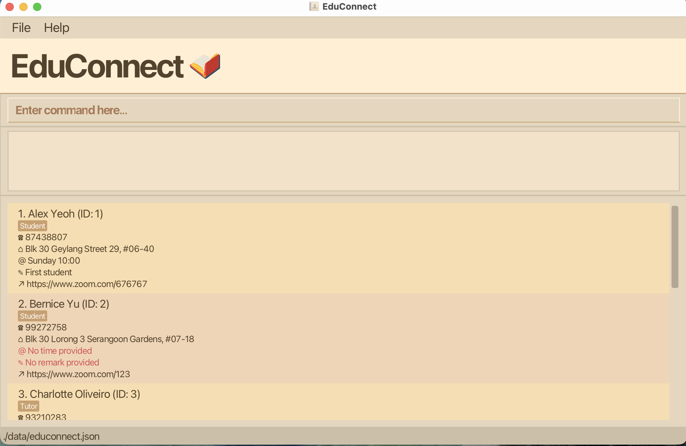

# EduConnect

* This project serves to develop EduConnect, a desktop application that enables private tutors to seamlessly manage their work contacts.
* Entries of contact details can be organised into 3 categories - students, parents and other tutors.
* For the detailed documentation of this project, see the **[EduConnect Product Website](https://ay2526s2-cs2103-f09-1.github.io/tp/)**.
* This project is based on the AddressBook-Level3 project created by the [SE-EDU initiative](https://se-education.org).
