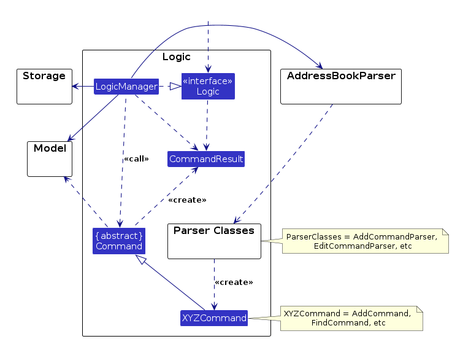
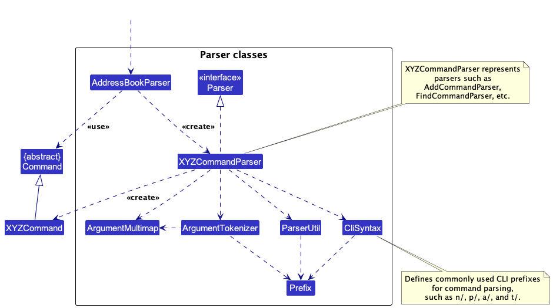
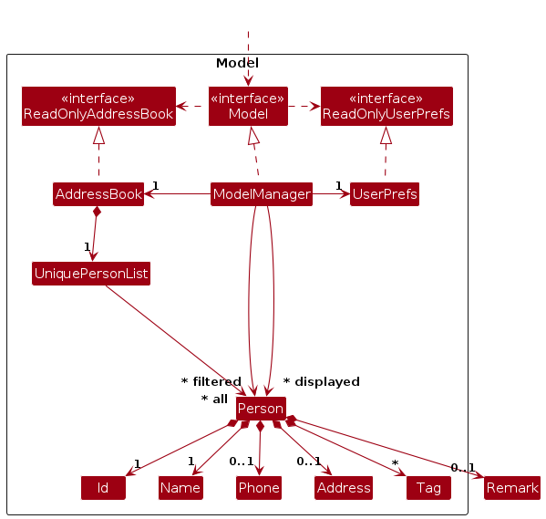

* Table of Contents
{:toc}

--------------------------------------------------------------------------------------------------------------------

## **Acknowledgements**

* This project is based on the AddressBook-Level3 project created by the [SE-EDU initiative](https://se-education.org).
* Libraries used: [JavaFX](https://openjfx.io/), [Jackson](https://github.com/FasterXML/jackson), [JUnit5](https://github.com/junit-team/junit5)

--------------------------------------------------------------------------------------------------------------------

## **Setting up, getting started**

Refer to the guide [_Setting up and getting started_](SettingUp.md).

--------------------------------------------------------------------------------------------------------------------

## **Design**

:bulb: **Tip:** The `.puml` files used to create diagrams are in this document `docs/diagrams` folder. Refer to the [_PlantUML Tutorial_ at se-edu/guides](https://se-education.org/guides/tutorials/plantUml.html) to learn how to create and edit diagrams.

### Architecture

The ***Architecture Diagram*** given above explains the high-level design of the App.

Given below is a quick overview of main components and how they interact with each other.

**Main components of the architecture**

**`Main`** (consisting of classes [`Main`](https://github.com/se-edu/addressbook-level3/tree/master/src/main/java/seedu/address/Main.java) and [`MainApp`](https://github.com/se-edu/addressbook-level3/tree/master/src/main/java/seedu/address/MainApp.java)) is in charge of the app launch and shut down.
* At app launch, it initializes the other components in the correct sequence, and connects them up with each other.
* At shut down, it shuts down the other components and invokes cleanup methods where necessary.

The bulk of the app's work is done by the following four components:

* [**`UI`**](#ui-component): The UI of the App.
* [**`Logic`**](#logic-component): The command executor.
* [**`Model`**](#model-component): Holds the data of the App in memory.
* [**`Storage`**](#storage-component): Reads data from, and writes data to, the hard disk.

[**`Commons`**](#common-classes) represents a collection of classes used by multiple other components.

**How the architecture components interact with each other**

The *Sequence Diagram* below shows how the components interact with each other for the scenario where the user issues the command `delete 1`.

Each of the four main components (also shown in the diagram above),

* defines its *API* in an `interface` with the same name as the Component.
* implements its functionality using a concrete `{Component Name}Manager` class (which follows the corresponding API `interface` mentioned in the previous point.

For example, the `Logic` component defines its API in the `Logic.java` interface and implements its functionality using the `LogicManager.java` class which follows the `Logic` interface. Other components interact with a given component through its interface rather than the concrete class (reason: to prevent outside component's being coupled to the implementation of a component), as illustrated in the (partial) class diagram below.

The sections below give more details of each component.

### UI component

The **API** of this component is specified in [`Ui.java`](https://github.com/se-edu/addressbook-level3/tree/master/src/main/java/seedu/address/ui/Ui.java)

The UI consists of a `MainWindow` that is made up of parts e.g.`CommandBox`, `ResultDisplay`, `PersonListPanel`, `StatusBarFooter` etc. All these, including the `MainWindow`, inherit from the abstract `UiPart` class which captures the commonalities between classes that represent parts of the visible GUI.

The `UI` component uses the JavaFx UI framework. The layout of these UI parts are defined in matching `.fxml` files that are in the `src/main/resources/view` folder. For example, the layout of the [`MainWindow`](https://github.com/se-edu/addressbook-level3/tree/master/src/main/java/seedu/address/ui/MainWindow.java) is specified in [`MainWindow.fxml`](https://github.com/se-edu/addressbook-level3/tree/master/src/main/resources/view/MainWindow.fxml)

The `UI` component,

* executes user commands using the `Logic` component.
* listens for changes to `Model` data so that the UI can be updated with the modified data.
* keeps a reference to the `Logic` component, because the `UI` relies on the `Logic` to execute commands.
* depends on some classes in the `Model` component, as it displays `Person` object residing in the `Model`.

### Logic component

**API** : [`Logic.java`](https://github.com/se-edu/addressbook-level3/tree/master/src/main/java/seedu/address/logic/Logic.java)

Here's a (partial) class diagram of the `Logic` component:

The sequence diagram below illustrates the interactions within the `Logic` component, taking `execute("delete 1")` API call as an example.

:information_source: **Note:** The lifeline for `DeleteCommandParser` should end at the destroy marker (X) but due to a limitation of PlantUML, the lifeline continues till the end of diagram.

How the `Logic` component works:

1. When `Logic` is called upon to execute a command, it is passed to an `AddressBookParser` object which in turn creates a parser that matches the command (e.g., `DeleteCommandParser`) and uses it to parse the command.
1. This results in a `Command` object (more precisely, an object of one of its subclasses e.g., `DeleteCommand`) which is executed by the `LogicManager`.
1. The command can communicate with the `Model` when it is executed (e.g. to delete a person). 
   Note that although this is shown as a single step in the diagram above (for simplicity), in the code it can take several interactions (between the command object and the `Model`) to achieve.
1. The result of the command execution is encapsulated as a `CommandResult` object which is returned back from `Logic`.

Here are the other classes in `Logic` (omitted from the class diagram above) that are used for parsing a user command:

How the parsing works:
* When called upon to parse a user command, the `AddressBookParser` class creates an `XYZCommandParser` (`XYZ` is a placeholder for the specific command name e.g., `AddCommandParser`) which uses the other classes shown above to parse the user command and create a `XYZCommand` object (e.g., `AddCommand`) which the `AddressBookParser` returns back as a `Command` object.
* All `XYZCommandParser` classes (e.g., `AddCommandParser`, `DeleteCommandParser`, ...) inherit from the `Parser` interface so that they can be treated similarly where possible e.g, during testing.

### Model component
**API** : [`Model.java`](https://github.com/AY2526S2-CS2103-F09-1/tp/blob/master/src/main/java/seedu/address/model/Model.java)

The `Model` component,

* stores the address book data i.e., all `Person` objects (which are contained in a `UniquePersonList` object).
* stores the currently 'selected' `Person` objects (e.g., results of a search query) as a separate _filtered_ list which is exposed to outsiders as an unmodifiable `ObservableList<Person>` that can be 'observed' e.g. the UI can be bound to this list so that the UI automatically updates when the data in the list change.
* stores a `UserPref` object that represents the user’s preferences. This is exposed to the outside as a `ReadOnlyUserPref` objects.
* does not depend on any of the other three components (as the `Model` represents data entities of the domain, they should make sense on their own without depending on other components)

:information_source: **Note:** An alternative (arguably, a more OOP) model is given below. It has a `Tag` list in the `AddressBook`, which `Person` references. This allows `AddressBook` to only require one `Tag` object per unique tag, instead of each `Person` needing their own `Tag` objects. 

### Storage component

**API** : [`Storage.java`](https://github.com/se-edu/addressbook-level3/tree/master/src/main/java/seedu/address/storage/Storage.java)

The `Storage` component,
* can save both address book data and user preference data in JSON format, and read them back into corresponding objects.
* inherits from both `AddressBookStorage` and `UserPrefStorage`, which means it can be treated as either one (if only the functionality of only one is needed).
* depends on some classes in the `Model` component (because the `Storage` component's job is to save/retrieve objects that belong to the `Model`)

### Common classes

Classes used by multiple components are in the `seedu.address.commons` package.

--------------------------------------------------------------------------------------------------------------------

## **Implementation**

This section describes some noteworthy details on how certain features are implemented.

### \[Proposed\] Undo/redo feature

#### Proposed Implementation

The proposed undo/redo mechanism is facilitated by `VersionedAddressBook`. It extends `AddressBook` with an undo/redo history, stored internally as an `addressBookStateList` and `currentStatePointer`. Additionally, it implements the following operations:

* `VersionedAddressBook#commit()` — Saves the current address book state in its history.
* `VersionedAddressBook#undo()` — Restores the previous address book state from its history.
* `VersionedAddressBook#redo()` — Restores a previously undone address book state from its history.

These operations are exposed in the `Model` interface as `Model#commitAddressBook()`, `Model#undoAddressBook()` and `Model#redoAddressBook()` respectively.

Given below is an example usage scenario and how the undo/redo mechanism behaves at each step.

Step 1. The user launches the application for the first time. The `VersionedAddressBook` will be initialized with the initial address book state, and the `currentStatePointer` pointing to that single address book state.

Step 2. The user executes `delete 5` command to delete the 5th person in the address book. The `delete` command calls `Model#commitAddressBook()`, causing the modified state of the address book after the `delete 5` command executes to be saved in the `addressBookStateList`, and the `currentStatePointer` is shifted to the newly inserted address book state.

Step 3. The user executes `add n/David …​` to add a new person. The `add` command also calls `Model#commitAddressBook()`, causing another modified address book state to be saved into the `addressBookStateList`.

:information_source: **Note:** If a command fails its execution, it will not call `Model#commitAddressBook()`, so the address book state will not be saved into the `addressBookStateList`.

Step 4. The user now decides that adding the person was a mistake, and decides to undo that action by executing the `undo` command. The `undo` command will call `Model#undoAddressBook()`, which will shift the `currentStatePointer` once to the left, pointing it to the previous address book state, and restores the address book to that state.

:information_source: **Note:** If the `currentStatePointer` is at index 0, pointing to the initial AddressBook state, then there are no previous AddressBook states to restore. The `undo` command uses `Model#canUndoAddressBook()` to check if this is the case. If so, it will return an error to the user rather
than attempting to perform the undo.

The following sequence diagram shows how an undo operation goes through the `Logic` component:

:information_source: **Note:** The lifeline for `UndoCommand` should end at the destroy marker (X) but due to a limitation of PlantUML, the lifeline reaches the end of diagram.

Similarly, how an undo operation goes through the `Model` component is shown below:

The `redo` command does the opposite — it calls `Model#redoAddressBook()`, which shifts the `currentStatePointer` once to the right, pointing to the previously undone state, and restores the address book to that state.

:information_source: **Note:** If the `currentStatePointer` is at index `addressBookStateList.size() - 1`, pointing to the latest address book state, then there are no undone AddressBook states to restore. The `redo` command uses `Model#canRedoAddressBook()` to check if this is the case. If so, it will return an error to the user rather than attempting to perform the redo.

Step 5. The user then decides to execute the command `list`. Commands that do not modify the address book, such as `list`, will usually not call `Model#commitAddressBook()`, `Model#undoAddressBook()` or `Model#redoAddressBook()`. Thus, the `addressBookStateList` remains unchanged.

Step 6. The user executes `clear`, which calls `Model#commitAddressBook()`. Since the `currentStatePointer` is not pointing at the end of the `addressBookStateList`, all address book states after the `currentStatePointer` will be purged. Reason: It no longer makes sense to redo the `add n/David …​` command. This is the behavior that most modern desktop applications follow.

The following activity diagram summarizes what happens when a user executes a new command:

#### Design considerations:

**Aspect: How undo & redo executes:**

* **Alternative 1 (current choice):** Saves the entire address book.
  * Pros: Easy to implement.
  * Cons: May have performance issues in terms of memory usage.

* **Alternative 2:** Individual command knows how to undo/redo by
  itself.
  * Pros: Will use less memory (e.g. for `delete`, just save the person being deleted).
  * Cons: We must ensure that the implementation of each individual command are correct.

_{more aspects and alternatives to be added}_

### \[Proposed\] Data archiving

_{Explain here how the data archiving feature will be implemented}_

--------------------------------------------------------------------------------------------------------------------

## **Documentation, logging, testing, configuration, dev-ops**

* [Documentation guide](Documentation.md)
* [Testing guide](Testing.md)
* [Logging guide](Logging.md)
* [Configuration guide](Configuration.md)
* [DevOps guide](DevOps.md)

--------------------------------------------------------------------------------------------------------------------

## **Appendix: Requirements**

### Product scope

**Target user profile**: Part-time private tutors

* Teach many students at the same time, all across Singapore
* Contact parents daily for administrative purposes (payment, scheduling of lessons, location of lessons, etc.)
* In contact with many other private tutors, to exchange teaching ideas and learning materials
* Type very fast, dislike using the mouse
* Face-blind
* Have a bad memory
* Use WhatsApp as their main mode of contact 
* Prefer quick filtering of contacts
* Value speed, efficiency, and minimal friction in workflows

**Value proposition**: To help private tutors seamlessly manage daily tasks in their work. These include contacting parents for announcements, administrative matters or emergencies. They can also involve contacting other tutors for pedagogical discussions or the exchange of learning materials.

### User stories

Priorities: High (must have) - `* * *`, Medium (nice to have) - `* *`, Low (unlikely to have) - `*`

| Priority | As a …​                                                                  | I want to …​                                                           | So that I can…​                                                                                               |
|----------|--------------------------------------------------------------------------|------------------------------------------------------------------------|---------------------------------------------------------------------------------------------------------------|
| `* * *`  | tutor                                                                    | add new contacts to EduConnect                                         | track the contact details of relevant people involved in my work - such as students, parents and other tutors |
| `* * *`  | clumsy tutor                                                             | delete existing contacts from EduConnect                               | remove details that have been entered incorrectly                                                             |
| `* * *`  | tutor who teaches many students and is in contact with many other tutors | categorise my contact list into 3 groups - students, parents and tutors | filter for the required group more quickly                                                                    |
| `* * *`  | tutor                                                                    | view a student’s home address in EduConnect                            | navigate to the correct location for lessons                                                                  |
| `* *`    | tutor who has many clients                                               | search for a specific contact by name                                       | more swiftly obtain the contact information of the person in question                                         |
| `* *`    | tutor                                                                    | quickly retrieve a student’s phone number from EduConnect and copy it                   | contact the student via WhatsApp without searching manually                                                   |
| `* *`    | tutor whose students’ or parents’ phone numbers change                                                              | easily update their contact details           | avoid contacting the wrong number in the future                                                               |
| `* *`    | tutor who has online lessons       | access an online meeting link for the lesson on EduConnect and copy it into my clipboard with a click    | start the lesson quickly     |
| `*`    | tutor who values efficiency       | learn about EduConnect’s basic controls through a beginner’s tutorial         | pick up the app more quickly       |
| `*`    | face-blind tutor | add pictures of my students to their names and contact details | remember how each of my students look like    |
| `*`    | tutor who teaches many students | pair up the contact details of a student with those of his / her parents | remember who are the parents of a given student |
| `*`    | tutor | save frequently used commands as shortcuts | perform common commands more quickly |
| `*`    | tutor | view shortcuts I added | look it up when I forget |
| `*`    | tutor | edit and remove those shortcuts I added if they become irrelevant | prevent shortcuts from clustering too much or I need to change it to something more convenient |

*{More to be added}*

### Use cases

System: EduConnect

#### Use case: UC01 - Add Contact

Actor: User

Guarantees:
* On successful completion, exactly one new contact is stored.
* If the operation fails, the stored contacts remain unchanged.

MSS:
1. User requests to add a contact by providing a name. Optionally, he can also provide a phone number, an address and a list of tags.
2. EduConnect validates the provided details.
3. EduConnect adds the contact.
4. EduConnect shows a success message with the added contact details.
Use case ends.

Extensions:
* 1a. User omits a required detail, or provides an empty required detail.
  * 1a1. EduConnect shows an error message and input guidance.
  * 1a2. User re-enters the contact details.
  * Steps 1a1-1a2 are repeated until valid input is provided.
  * Use case resumes from step 2.
* 2a. User provides an invalid format for at least one of the fields.
  * 2a1. EduConnect shows an error message.
  * 2a2. User re-enters the contact details.
  * Steps 2a1-2a2 are repeated until valid input is provided.
  * Use case resumes from step 2.
* 2b. User provides the same field more than once.
  * 2b1. EduConnect shows an error message.
  * 2b2. User re-enters the contact details.
  * Steps 2b1-2b2 are repeated until valid input is provided.
  * Use case resumes from step 2.
* 2c. The new contact is a duplicate of an existing contact.
  * 2c1. EduConnect shows a duplicate contact error.
  * 2c2. User re-enters the contact details.
  * Steps 2c1-2c2 are repeated until valid input is provided.
  * Use case resumes from step 2.

#### Use case: UC02 - Delete Contact
Actor: User

Guarantees:
* On successful completion, exactly one existing contact is removed from the stored contacts.
* If the operation fails, the stored contacts remain unchanged.

MSS:
1. User requests to delete a contact by specifying the displayed contact reference.
2. EduConnect validates the contact reference.
3. EduConnect deletes the selected contact.
4. EduConnect shows a success message with deleted contact details.
Use case ends.

Extensions:
* 1a. User omits the contact reference, or provides too much input.
  * 1a1. EduConnect shows an error message.
  * 1a2. User re-submits the deletion request.
  * Steps 1a1-1a2 are repeated until valid input is provided.
  * Use case resumes from step 2.
* 2a. The contact reference is not a valid positive integer.
  * 2a1. EduConnect shows an error message.
  * 2a2. User re-submits the deletion request.
  * Steps 2a1-2a2 are repeated until valid input is provided.
  * Use case resumes from step 2.
* 2b. The contact reference is not found in the address book.
  * 2b1. EduConnect shows an error message.
  * 2b2. User re-submits the deletion request.
  * Steps 2b1-2b2 are repeated until valid input is provided.
  * Use case resumes from step 2.
  
#### Use case: UC03 - Update Contact Tags
Actor: User

Guarantees:
* On successful completion, the selected contact has the updated tags.
* If the operation fails, no contact is modified.

MSS:
1. User requests to edit a contact's tags.
2. EduConnect validates the contact reference and tag value.
3. EduConnect appends the provided tags to the selected contact.
4. EduConnect shows a success message.
Use case ends.

Extensions:
* 1a. User omits required details, or provides an empty required detail.
  * 1a1. EduConnect shows an error message and input guidance.
  * 1a2. User re-submits the edit request.
  * Steps 1a1-1a2 are repeated until valid input is provided.
  * Use case resumes from step 2.
* 1b. User provides the same required detail more than once.
  * 1b1. EduConnect shows an error message.
  * 1b2. User re-submits the edit request.
  * Steps 1b1-1b2 are repeated until valid input is provided.
  * Use case resumes from step 2.
* 2a. The contact reference is invalid or not found in the address book.
  * 2a1. EduConnect shows an error message.
  * 2a2. User re-submits the edit request.
  * Steps 2a1-2a2 are repeated until valid input is provided.
  * Use case resumes from step 2.
* 2b. The provided tag is not a valid tag.
  * 2b1. EduConnect shows an error message.
  * 2b2. User re-submits the edit request.
  * Steps 2b1-2b2 are repeated until valid input is provided.
  * Use case resumes from step 2.
* 2c. The user requests to clear all tags and also provides one or more tag values.
  * 2c1. EduConnect shows an error message.
  * 2c2. User re-submits the edit request.
  * Steps 2c1-2c2 are repeated until valid input is provided.
  * Use case resumes from step 2.
* 3a. The selected contact already has one or more tags.
  * 3a1. EduConnect appends any missing tags and keeps existing tags unchanged.
  * Use case resumes from step 4.
* 3b. The user requests to clear all existing tags.
  * 3b1. EduConnect clears all existing tags for the selected contact.
  * Use case resumes from step 4.

#### Use case: UC04 - View Phone Number and Address
Actor: User

Guarantees:
* On successful completion, EduConnect displays the stored contacts with their names, phone numbers, and addresses.
* If a stored phone number or address is missing, EduConnect indicates that the field is missing.
* This use case does not modify stored contact data.

MSS:
1. User requests to view contact information.
2. EduConnect displays each contact's name, phone number, and address.
Use case ends.

Extensions:
* 2a. There are no contacts.
  * 2a1. EduConnect displays that no contacts are currently available.
  * Use case ends.
* 2b. A contact is missing a phone number or address.
  * 2b1. EduConnect displays a missing-field indicator for that field.
  * Use case resumes from step 2.
* 2c. Multiple contacts share the same name and tag.
  * 2c1. EduConnect displays all matching contacts distinctly so the user can differentiate them.
  * Use case resumes from step 2.

#### Use case: UC05 - Edit Contact
Actor: User

Guarantees:
* On successful completion, the specified contact is updated with the provided values.
* Name, phone, and address replace their previous values when provided.
* Provided tags are added cumulatively to the contact's existing tags, unless the user explicitly requests to clear all tags.
* If the operation fails, the stored contacts remain unchanged.

MSS:
1. User requests to edit a contact by specifying the contact ID and one or more fields to update.
2. EduConnect validates the contact ID and edited field values.
3. EduConnect updates the selected contact.
4. EduConnect shows a success message with the updated contact details.
Use case ends.

Extensions:
* 1a. User omits the contact ID or all editable fields.
  * 1a1. EduConnect shows an error message and input guidance.
  * 1a2. User re-submits the edit request.
  * Steps 1a1-1a2 are repeated until valid input is provided.
  * Use case resumes from step 2.
* 1b. User repeats a non-tag field.
  * 1b1. EduConnect shows an error message.
  * 1b2. User re-submits the edit request.
  * Use case resumes from step 2.
* 2a. The contact ID is invalid or not found in the address book.
  * 2a1. EduConnect shows an error message.
  * 2a2. User re-submits the edit request.
  * Use case resumes from step 2.
* 2b. The user provides an invalid field value.
  * 2b1. EduConnect shows an error message.
  * 2b2. User re-submits the edit request.
  * Use case resumes from step 2.
* 3a. The user provides one or more tags.
  * 3a1. EduConnect adds those tags to the contact's existing tags.
  * Use case resumes from step 4.
* 3b. The user requests to clear all tags.
  * 3b1. EduConnect clears all tags from the contact.
  * Use case resumes from step 4.

#### Use case: UC06 - Search Contacts by Specified Fields
Actor: User

Guarantees:
* On successful completion, EduConnect shows only those contacts which have a field (ie. name / address / phone number / tags) matching at least one provided keyword, for that corresponding field. EduConnect also displays the number of contacts found.
* Each matching contact appears at most once in the filtered results.
* If no contacts match, EduConnect shows an empty filtered result.
* If the operation fails, the currently displayed contacts remain unchanged.

MSS:
1. User requests to search contacts by entering one or more keywords, each marked with a specific field.
2. EduConnect finds contacts which has a field that correspondingly matches at least one of the keywords, associated with that field.
3. EduConnect shows the filtered results and match count.
Use case ends.

Extensions:
* 1a. User provides no keyword.
  * 1a1. EduConnect shows an error message and requests at least one keyword.
  * 1a2. User re-enters the search input.
  * Steps 1a1-1a2 are repeated until at least one keyword is provided.
  * Use case resumes from step 2.
* 1b. User provides a keyword that is not marked with a field.
  * 1b1. EduConnect shows an error message explaining the required input format.
  * 1b2. User re-enters the search input.
  * Use case resumes from step 2.
* 2a. No contacts match the keywords.
  * 2a1. EduConnect shows empty filtered results and a count of zero.
  * Use case ends.
* 2b. A contact matches multiple keywords.
  * 2b1. EduConnect includes that contact once in the filtered results.
  * Use case ends.

### Non-Functional Requirements

1. Should work on any Mainstream OS (Windows, macOS, Linux) as long as it has Java 17 installed.
2. Should be able to hold up to 1000 contacts without a noticeable drop in performance for typical usage.
3. Should not require more than 200MB of total disk space, including the application and all stored data, for up to 1000 contacts.
4. Should respond to any user command within 1 second on a machine with at least 1GB of RAM available.
5. A user with above average typing speed for regular English text (i.e. not code, not system admin commands) should be able to accomplish most of the tasks faster using commands than using the mouse.
6. Should not require internet connection to function.
7. A user should be able to transfer all contact data to another computer by transferring a single contact data file.
8. Should ensure no data is lost by saving all changes to disk after every command that modifies contact data.
9. The program should not crash upon reading from a corrupted contact data file.

### Glossary

* **Tutor**: Refers to a private tutor, which is a user of the EduConnect application
* **Student**: Refers to a student whom the tutor is teaching
* **Parent**: Refers to a parent of a student whom the tutor is teaching
* **Mainstream OS**: Windows, Linux, Unix, MacOS
* **Duplicate contacts**: Two contacts are said to be duplicates if they have the same name, phone number and address

--------------------------------------------------------------------------------------------------------------------

## **Appendix: Instructions for manual testing**

Given below are instructions to test the app manually.

:information_source: **Note:** These instructions only provide a starting point for testers to work on;
testers are expected to do more *exploratory* testing.

### Launch and shutdown

1. Initial launch

   1. Download the jar file and copy into an empty folder

   1. Double-click the jar file Expected: Shows the GUI with a set of sample contacts. The window size may not be optimum.

1. Saving window preferences

   1. Resize the window to an optimum size. Move the window to a different location. Close the window.

   1. Re-launch the app by double-clicking the jar file. 
       Expected: The most recent window size and location is retained.

1. _{ more test cases …​ }_

### Deleting a person

1. Deleting a person while all persons are being shown

   1. Prerequisites: List all persons using the `list` command. Multiple persons in the list.

   1. Test case: `del 1` 
      Expected: The contact with `ID` 1 is deleted from the address book. Details of the deleted contact shown as a person card. Timestamp in the status bar is updated.

   1. Test case: `del 0` 
      Expected: No person is deleted. Error details shown in the status message. Status bar remains the same.

   1. Other incorrect delete commands to try: `del`, `del this`, `del -1`, `del x`, `...` (where `x` is not found in the address book) 
      Expected: Similar to previous.

1. _{ more test cases …​ }_

### Saving data

1. Dealing with missing/corrupted data files

   1. _{explain how to simulate a missing/corrupted file, and the expected behavior}_

1. _{ more test cases …​ }_
