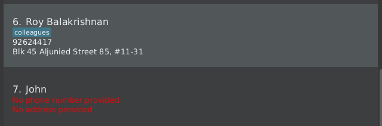

EduConnect is a **desktop application that enables private tutors to manage their work contacts, optimized for use via a Command Line Interface (CLI)** while still having the benefits of a Graphical User Interface (GUI). If you can type fast, EduConnect can get your contact management tasks done faster than traditional GUI apps.

* Table of Contents
{:toc}

--------------------------------------------------------------------------------------------------------------------

## Quick start

1. Ensure you have Java `17` or above installed in your Computer. 
   **Mac users:** Ensure you have the precise JDK version prescribed [here](https://se-education.org/guides/tutorials/javaInstallationMac.html).

1. Download the latest `.jar` file from [here](https://github.com/AY2526S2-CS2103-F09-1/tp/releases).

1. Copy the file to the folder you want to use as the _home folder_ for EduConnect.

1. Open a command terminal, `cd` into the folder you put the jar file in, and use the `java -jar educonnect.jar` command to run the application. 
   A GUI similar to the below should appear in a few seconds. Note how the app contains some sample data. 
   

1. Type the command in the command box and press Enter to execute it. e.g. typing **`help`** and pressing Enter will open the help window. 
   Some example commands you can try:

   * `list` : Lists all contacts.

   * `add n/John Doe p/98765432 a/1A Kent Ridge Rd, 119224` : Adds a contact named `John Doe` with a phone number `98765432` and address `1A Kent Ridge Rd, 119224` to the Address Book.

   * `del 3` : Deletes the contact with an `ID` of 3.

   * `clear` : Deletes all contacts.

   * `exit` : Exits the app.

1. Refer to the [Features](#features) below for details of each command.

--------------------------------------------------------------------------------------------------------------------

## Features

**:information_source: Notes about the command format:** 

* Words in `UPPER_CASE` are the parameters to be supplied by the user. 
  e.g. in `add n/NAME`, `NAME` is a parameter which can be used as `add n/John Doe`.

* Items in square brackets are optional. 
  e.g `n/NAME [t/CATEGORY]` can be used as `n/John Doe t/Student` or as `n/John Doe`.

* Items with `…`​ after them can be used multiple times including zero times. 
  e.g. `[t/CATEGORY]…​` can be used as ` ` (i.e. 0 times), `t/Student`, `t/Student t/Parent` etc.

* Parameters can be in any order. 
  e.g. if the command specifies `n/NAME p/PHONE_NUMBER`, `p/PHONE_NUMBER n/NAME` is also acceptable.

* Extraneous parameters for commands that do not take in parameters (such as `help`, `list`, `exit` and `clear`) will be ignored. 
  e.g. if the command specifies `help 123`, it will be interpreted as `help`.

* If you are using a PDF version of this document, be careful when copying and pasting commands that span multiple lines as space characters surrounding line-breaks may be omitted when copied over to the application.

### Viewing help : `help`

Shows a message explaining how to access the help page.

Format: `help`

### Adding a person: `add`

Adds a person to the address book.

Format: `add n/NAME [p/PHONE_NUMBER] [a/ADDRESS] [t/CATEGORY]…​`

:bulb: **Tip:**
A person can have any number of categories (including 0)

* Only `n/NAME` is required.
* `p/PHONE_NUMBER`, `a/ADDRESS`, and `t/TAG` are optional.
* `add n/John Doe` and `add n/John Doe p/` are both valid. Both create a contact without a phone number.

Examples:
* `add n/John Doe t/Student p/98765432 a/John street, block 123, #01-01`
* `add n/Jane Doe p/98765432`

### Listing all persons : `list`

Shows a list of all persons in the address book.

Format: `list`

* Since phone number and address fields are optional, the UI alerts the user if a particular person has no phone number or address:

  

### Editing a person : `edit`

Edits an existing person in the address book.

Format: `edit ID [n/NAME] [p/PHONE] [a/ADDRESS] [t/TAG]…​`

* Edits the person with the specified `ID`. `ID` **must be a positive integer** 1, 2, 3, …​
* At least one of the optional fields must be provided.
* Existing values will be updated to the input values.
* When editing tags, the new tags are added to the person's existing tags.
* You can remove all the person’s tags by typing `t/` without
    specifying any tags after it.

Examples:
*  `edit 1 p/91234567` Edits the phone number of the person with `ID` 1, changing it to `91234567`.
*  `edit 1 t/Parent` Adds the `Parent` tag to the person with `ID` 1's existing tags.
*  `edit 2 n/Betsy Crower t/` Edits the name of the person with `ID` 2, changing it to `Betsy Crower`, whilst clearing all existing tags.

### Locating persons: `find`

Finds persons whose specified fields contain any of the given keywords.

Format: `find [n/NAME]... [a/ADDRESS]... [p/PHONE]... [t/TAG]...`

* At least one prefixed keyword must be provided.
* Unprefixed input is not allowed. e.g. `find Ali` is invalid.
* `n/` searches names, `a/` searches addresses, `p/` searches phone numbers, and `t/` searches tags.
* The search is case-insensitive for names, addresses, and tags. e.g. `n/hans` will match `Hans` and `t/student` will match `Student`
* Phone matching is digit-based substring matching. e.g. `p/9435` will match a phone number containing `9435`
* Partial matches are supported. e.g. `n/Han` will match `Hans`
* Persons matching at least one prefixed keyword will be returned (i.e. `OR` search across all provided fields and keywords).
* Repeating the same prefix is allowed. e.g. `find n/Ali n/August`

Examples:
* `find a/119224` returns persons whose address contains `119224`
* `find n/Clement` returns persons whose name contains `Clement`
* `find p/9435` returns persons whose phone number contains `9435`
* `find n/aleX a/seran` returns persons whose name contains `aleX` or whose address contains `seran`
* `find t/student` returns persons whose tags contain `student`
* `find n/Ali n/August` returns persons whose names contain `Ali` or `August`

Notes:
- Every search term must be attached to a prefix.
- Contacts matching multiple keywords still appear only once in the filtered list.

### Deleting a person : `del`

Deletes the specified person from the address book.

Format: `del ID`

* Deletes the person with the specified `ID`.
* `ID` **must be a positive integer** 1, 2, 3, …​

Examples:
* `del 2` deletes the person with `ID` 2 from the address book.
* `find n/Betsy` followed by `del 1` deletes the person with `ID` 1 from the address book. Note that it does not delete the first person in the results of the `find` command.
* `add n/Andrew` followed by `del 1` deletes the person with `ID` 1 from the address book. Note that it does not delete the contact that was just added.
* `add n/Andrew` followed by `del 1` will fail if there is no person with `ID` 1 in the address book.

### Copying a person information; `copy`

Copy a specified field of a person from the address book to the user clipboard.

Format: `copy ID field`

* Copies the `field` data for the person with the specified `ID` to the user clipboard.
* Possible fields include `n/` for name, `p/` for phone number, and `a/` for address
* If the person's field is empty, then nothing will be copy to the clipboard.

Examples:
* `copy 6 n/` copy the name of the person with `ID` 6 to the clipboard.
* `copy 7 p/` copy the phone number of the person with `ID` 7 to the clipboard.
* `copy 9 a/` copy the address of the person with `ID` 9 to the clipboard.
* `copy 1 p/` will fail if `ID` 1 is not found or the phone number field of the person with `ID` 1 is empty. 

### Clearing all entries : `clear`

Clears all entries from the address book, whilst displaying all the contacts that have been removed.

Format: `clear`

### Exiting the program : `exit`

Exits the program.

Format: `exit`

### Saving the data

EduConnect data is saved in the hard disk automatically after any command that changes the data. There is no need to save manually.

### Editing the data file

EduConnect data is saved automatically as a JSON file `[JAR file location]/data/addressbook.json`. Advanced users are welcome to update data directly by editing that data file.

:exclamation: **Caution:**
If your changes to the data file makes its format invalid, EduConnect will discard all data and start with an empty data file at the next run. Hence, it is recommended to take a backup of the file before editing it. 
Furthermore, certain edits can cause EduConnect to behave in unexpected ways (e.g., if a value entered is outside of the acceptable range). Therefore, edit the data file only if you are confident that you can update it correctly.

### Archiving data files `[coming in v2.0]`

_Details coming soon ..._

--------------------------------------------------------------------------------------------------------------------

## FAQ

**Q**: How do I transfer my data to another Computer? 
**A**: Install the app in the other computer and overwrite the empty data file it creates with the file that contains the data of your previous EduConnect home folder.

--------------------------------------------------------------------------------------------------------------------

## Known issues

1. **When using multiple screens**, if you move the application to a secondary screen, and later switch to using only the primary screen, the GUI will open off-screen. The remedy is to delete the `preferences.json` file created by the application before running the application again.
2. **If you minimize the Help Window** and then run the `help` command (or use the `Help` menu, or the keyboard shortcut `F1`) again, the original Help Window will remain minimized, and no new Help Window will appear. The remedy is to manually restore the minimized Help Window.

--------------------------------------------------------------------------------------------------------------------

## Command summary

Action | Format, Examples
--------|------------------
**Add** | `add n/NAME [p/PHONE_NUMBER] [a/ADDRESS] [t/TAG]…​`   e.g., `add n/James Ho`, `add n/James Ho p/`, `add n/James Ho p/22224444 a/123, Clementi Rd, 1234665 t/Parent t/Tutor`
**Clear** | `clear`
**Delete** | `del ID`  e.g., `del 3`
**Edit** | `edit ID [n/NAME] [p/PHONE_NUMBER] [a/ADDRESS] [t/TAG]…​`  e.g.,`edit 2 n/James Lee`
**Find** | `find [n/NAME]... [a/ADDRESS]... [p/PHONE]... [t/TAG]...`  e.g., `find n/James t/Student`
**List** | `list`
**Help** | `help`
