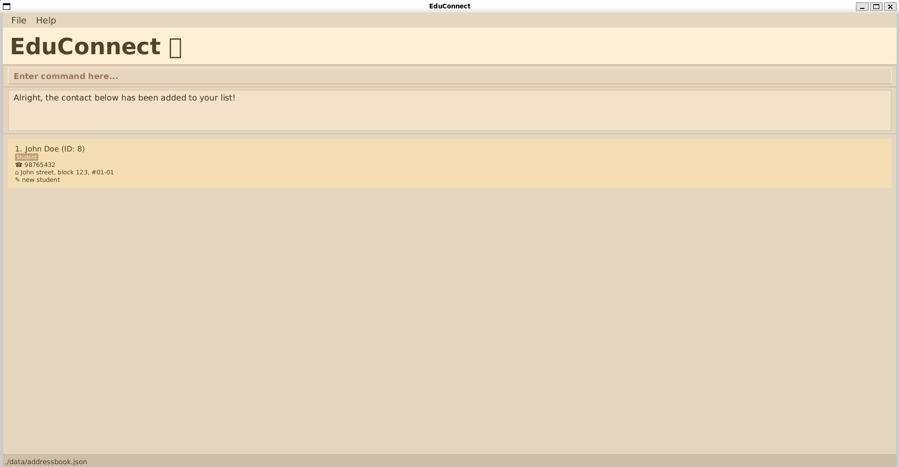

EduConnect is a **desktop application that enables private tutors to manage their work contacts, optimized for use via a Command Line Interface (CLI)** while still having the benefits of a Graphical User Interface (GUI). If you can type fast, EduConnect can get your contact management tasks done faster than traditional GUI apps.

* Table of Contents
{:toc}

--------------------------------------------------------------------------------------------------------------------

## Quick start

1. Ensure you have Java `17` or above installed in your Computer. 
   **Mac users:** Ensure you have the precise JDK version prescribed [here](https://se-education.org/guides/tutorials/javaInstallationMac.html).

1. Download the latest `.jar` file from [here](https://github.com/AY2526S2-CS2103-F09-1/tp/releases).

1. Copy the file to the folder you want to use as the _home folder_ for EduConnect.

1. Open a command terminal, `cd` into the folder you put the jar file in, and use the `java -jar educonnect.jar` command to run the application. 
   A GUI similar to the below should appear in a few seconds. Note how the app contains some sample data. 
   

1. Type the command in the command box and press Enter to execute it. e.g. typing **`help`** and pressing Enter will open the help window. 
   Tip: You can right-click the command box to access common text actions such as cut/copy/paste (the exact menu options may vary by OS). 
   Some example commands you can try:

   * `list`: List all contacts.

   * `add n/John Doe p/98765432 a/1A Kent Ridge Rd, 119224`: Add a contact named `John Doe` with a phone number `98765432` and address `1A Kent Ridge Rd, 119224` to the Address Book.

   * `del 3`: Delete the contact with an `ID` of 3.

   * `clear` (run twice to confirm): Delete all contacts.

   * `exit`: Exit the app.

1. Refer to the [Features](#features) below for details of each command.

--------------------------------------------------------------------------------------------------------------------

## Features

**:information_source: Notes about the command format:** 

* Words in `UPPER_CASE` are the parameters to be supplied by the user. 
  e.g. in `add n/NAME`, `NAME` is a parameter which can be used as `add n/John Doe`.

* Items in square brackets are optional. 
  e.g `n/NAME [t/TAG]` can be used as `n/John Doe t/Student` or as `n/John Doe`.

* Items with `…`​ after them can be used multiple times including zero times. 
  e.g. `[t/TAG]…​` can be used as ` ` (i.e. 0 times), `t/Student`, `t/Student t/Parent` etc.

* If you are using a PDF version of this document, be careful when copying and pasting commands that span multiple lines as space characters surrounding line-breaks may be omitted when copied over to the application.

* For more shared command behavior, see [Command Rules](#command-rules).

### Viewing help: `help`

💡 Show a message explaining how to access the help page.

Format: `help`

### Adding a person: `add`

💡 Add a person to the address book.

Format: `add n/NAME [p/PHONE_NUMBER] [a/ADDRESS] [r/REMARK] [d/WEEKLY_TIMESLOT] [l/MEETING_LINK] [t/TAG]…​`

:bulb: **Tip:**
A person can have any number of tags (including 0)

* Only `n/NAME` is required.
* `p/PHONE_NUMBER`, `a/ADDRESS`, `r/REMARK`, `d/WEEKLY_TIMESLOT`, `l/MEETING_LINK`, and `t/TAG` are optional (see [Command Rules](#command-rules) for shared constraints and behavior such as empty values).
* If the new contact is a duplicate of an existing contact, it will not be added. Duplicate contacts are defined as those with the same name, phone number and address.

Examples:
* `add n/John Doe t/Student p/98765432 a/John street, block 123, #01-01 r/new student`
* `add n/John Doe a/John street, block 123, #01-01 t/Parent t/Tutor`
* `add n/Jane Doe p/98765432 l/https://zoom.us/j/123456789`

The first example gives the following expected output:

  

### Listing all persons: `list`

Show a list of all persons in the address book.

Format: `list`

* The number of people currently in the contact list will also be shown.

### Editing a person: `edit`

Edit an existing person in the address book.

Format: `edit ID [n/NAME] [p/PHONE] [a/ADDRESS] [d/WEEKLY_TIMESLOT] [r/REMARK] [l/MEETING_LINK] [t/TAG]… [tdel/TAG]…​`

* `ID` specifies the person to be edited.
* At least one of the optional fields must be provided.
* Existing values will be updated to the input values (see [Command Rules](#command-rules) for shared constraints and how to clear fields using empty values such as `p/`, `d/`, or `t/`).
* Editing a contact such that it becomes identical to an existing contact is not allowed. Each contact must be unique.

**Tag rules**
* Use this command for all tag updates. EduConnect does not provide a separate `tag` command.
* `t/TAG` adds tags; `tdel/TAG` removes tags.
* Only valid tags may be used: `Student`, `Parent`, `Tutor` (case-insensitive).
* Repeating an existing tag has no effect; deleting a tag that the person does not have has no effect.
* To clear all tags, use `t/` by itself (do not combine it with any `t/TAG` or `tdel/TAG` in the same command).
* The same tag cannot be added and deleted in the same command.

Examples:
* `edit 1 p/91234567`: Set the phone number of contact 1.
* `edit 1 d/Monday 18:00`: Set the weekly timeslot of contact 1.
* `edit 1 d/Wednesday 1800 - 1930 l/https://zoom.us/j/123456789 t/Tutor tdel/Student`: Set weekly timeslot + meeting link, add `Tutor` tag, and remove `Student` tag.
* `edit 2 t/`: Clear all tags of contact 2.

Expected behavior:
* The `edit` command succeeds even if the provided values are identical to the existing ones (i.e., no changes are made).

### Locating persons: `find`

Find persons whose specified fields match the given keywords.

Format: `find [m/MODE] [n/NAME]… [a/ADDRESS]… [p/PHONE]… [t/TAG]… [r/REMARK]… [d/WEEKLY_TIMESLOT]…`

* At least one prefixed keyword must be provided; unprefixed keywords are not allowed (e.g. `find Alex` is invalid).
* See [Command Rules](#command-rules) for shared constraints and behavior.
* Repeating prefixes are allowed. Users can perform either an OR search or an AND search.
* Each contact will appear at most once in the results, even if multiple fields match.
* Contacts missing a field never match that field (e.g. contacts without a phone number never match `p/…`).

**Mode rules (`m`)**
* `m/` is optional, case-insensitive, and accepts only `and` or `or` (at most once).
* Without this prefix, the default is OR semantics.
* `m/and` requires all provided keywords to match.
* `m/or` requires at least one provided condition to match.

**Weekly timeslot rules (`d/`)**
* The `d/` prefix in `FindCommand` is less strict, as it is used for searching. See [Field constraints](#field-constraints) → `d/WEEKLY_TIMESLOT` for general behavior.
* `d/` supports day-only, time-only, and day + time queries.
* Day queries match contacts whose weekly timeslot falls on that day.
* Single time queries match either an exact stored time or a stored range containing that time.
* Range time queries match an exact stored range and may also match a stored single time within the query range.
* Day + time/range queries must match both the day and the specified time or range.
* Flexible formats (e.g., `DD:HH–DDHH` or similar variations) are allowed.

Examples (Find people whose):
* `find n/alex a/119224`: Name contains `alex` OR address contains `119224`.
* `find m/and t/student n/clement`: Tagged `Student` AND name contains `clement`.
* `find p/9`: Phone contains `9` (contacts without phone are excluded).
* `find d/1200 d/thu`: Weekly timeslot is `12:00` (or within a stored time range that includes `12:00`) or is on Thursday.
* `find d/tue 1500-1600`: Weekly timeslot is on Tuesday and is exactly `15:00 - 16:00` (or a stored single time within that range).

Expected behavior:
* `find p/ben` will not return an error, but will return no results (since phone numbers contain digits only).
* `find p/9` will not match contacts with no phone field (missing phone never matches `p/`).
* `find d/1500-1600` will not match a person whose time is `14:00 - 17:00` (range queries require an exact stored range match).
* `find t/best friend` will not return an error, but will return no results (as this is not a valid tag).

### Deleting a person: `del`

Delete one or more specified persons from the address book.

Format: `del ID [ID]…​`

* Deletes the persons with the specified `ID`s.
* Multiple IDs can be provided, separated by spaces.
* If any of the given IDs does not exist, none of the contacts will be deleted.

Examples:
* `del 2`: Delete the person with `ID` 2 from the address book.
* `del 1 3 5`: Delete the persons with `ID` 1, 3, and 5 from the address book atomically.
* `find n/Betsy` followed by `del 1`: Delete the person with `ID` 1 from the address book. Note that it does not delete the first person in the results of the `find` command.
* `del 1 99`: Fail if either `ID` 1 or `ID` 99 is not found — neither contact will be deleted.

### Copying a person information: `copy`

Copy a specified field of a person from the address book to the user clipboard.

Format: `copy ID FIELD`

* Possible fields include `n/` for name, `p/` for phone number, `a/` for address, and `l/` for meeting link.
* Copy is not supported for the weekly timeslot, tags, or remark fields. The `d/`, `t/`, `tdel/`, and `r/`
  fields are invalid for this command.
* If the person's field is empty, then nothing will be copied to the clipboard.

Examples:
* `copy 6 n/`: Copy the name of the person with `ID` 6 to the clipboard.
* `copy 7 p/`: Copy the phone number of the person with `ID` 7 to the clipboard.
* `copy 9 a/`: Copy the address of the person with `ID` 9 to the clipboard.
* `copy 1 l/`: Copy the meeting link of the person with `ID` 1 to the clipboard.
* `copy 1 p/`: Fail if `ID` 1 is not found or the phone number field of the person with `ID` 1 is empty.

### Clearing all entries: `clear`

Clear all entries from the address book (with a two-step confirmation), whilst displaying all the contacts that have been removed.

Format: `clear`

* The first `clear` shows a warning and does not delete anything.
* The second consecutive `clear` deletes all contacts.
* If any other command is entered in between (including an invalid command), the confirmation resets.

Examples:
* `clear` then `clear` clears the address book.
* `clear` then `list` then `clear` will show the warning again (the confirmation is reset).

### Exiting the program: `exit`

Exit the program.

Format: `exit`

### Saving the data

EduConnect data is saved in the hard disk automatically after any command that changes the data. There is no need to save manually.

### Editing the data file

EduConnect data is saved automatically as a JSON file `[JAR file location]/data/educonnect.json`. Advanced users are welcome to update data directly by editing that data file.

:exclamation: **Caution:**
If your changes to the data file makes its format invalid, EduConnect will discard all data and start with an empty data file at the next run. Hence, it is recommended to take a backup of the file before editing it. 
Furthermore, certain edits can cause EduConnect to behave in unexpected ways (e.g., if a value entered is outside of the acceptable range). Therefore, edit the data file only if you are confident that you can update it correctly.

## Command Rules

These rules apply across multiple commands in EduConnect:

### Command syntax

* Command words and prefixes are case-sensitive and must be typed in lowercase. 
  e.g. `add n/Alex` is valid, but `Add n/Alex` and `add N/Alex` are invalid.

* Extraneous parameters for commands that do not take in parameters (such as `help`, `list`, `exit` and `clear`) are ignored. 
  e.g. `help 123` is interpreted as `help`.

* Parameters can be in any order (unless stated otherwise). 
  e.g. `add p/98765432 n/Alex` is accepted.

* Leading and trailing spaces around prefixed values are ignored. 
  e.g. `add n/   Alex` is interpreted as `add n/Alex`.

* `ID` must be a positive integer 1, 2, 3, …​. Leading zeroes are accepted and ignored. 
  e.g. `edit 001 n/Ali` is interpreted as `edit 1 n/Ali`.

* ID is unique and not reused. Deleting a contact does not free its ID.  
  e.g., if the current ID is 10 and you delete contact 9, the next added contact will have ID 11.  
  Exception: If the latest contact (e.g., ID 10) is deleted, the next added contact will reuse ID 10.

* Empty values:
  * For `add`, providing an optional prefix with no value creates the contact with that field missing. 
    e.g. `add n/Jane Doe p/` creates a contact with no phone number.
  * For `edit`, providing a prefix with no value clears that field on the contact. 
    e.g. `edit 1 p/` clears the phone number of contact 1.
  * Exception (tags):
    * `add ... t/` is invalid. Omit `t/` to add a contact with no tags.
    * In `edit`, `t/` by itself clears all tags.
    * `tdel/` must be followed by a tag value (e.g. `tdel/Student`).

### Field constraints

* `n/NAME`:
  * Must not be blank.
  * Must contain only alphabets, `-`, `,`, and spaces.
  * Names that contain special characters like / may need to be stored in an alternative format (e.g., A/P can be written as AP or Anak Perempuan).

* `p/PHONE_NUMBER`:
  * Must contain digits only.
  * Must start with `6`, `8`, or `9`.
  * Must be exactly 8 digits long.
  * Rationale (Singapore): `8`/`9` are typically mobile numbers, and `6` is typically fixed-line.
  * Reference: [IMDA National Numbering Plan (PDF)](https://www.imda.gov.sg/-/media/imda/files/regulation-licensing-and-consultations/frameworks-and-policies/numbering/national-numbering-plan-and-allocation-process/imda-national-numbering-plan.pdf)

* `a/ADDRESS`:
  * Must not contain `/` (to avoid ambiguity with prefixes such as `n/` and `p/`).
  * Reference: [Singapore address format (example)](https://frasermclean.com/posts/singapore-address-format)

* `t/TAG`:
  * Must be one of `Student`, `Parent`, or `Tutor` (case-insensitive).
  * Repeating an existing tag has no effect because duplicate tags are not stored.

* `d/WEEKLY_TIMESLOT`:
  * Represents a weekly day/time (tuition sessions or recurring parent-tutor check-ins).
  * Accepted input forms (case insensitive):
    * day: accepts any unambiguous prefix with at least 2 letters (e.g., `d/mo`, `d/tue`)
    * single time: `Day HH:mm` or `Day HHmm`
    * time range: `Day HH:mm - HH:mm` or `Day HHmm - HHmm` (spaces around `-` are optional)
    * day must come before time (e.g. `d/tue 1500`, not `d/1500 tue`)
  * Valid weekdays: `Monday`, `Tuesday`, `Wednesday`, `Thursday`, `Friday`, `Saturday`, `Sunday`.
  * Valid time: 24-hour time (`00:00` to `23:59`). A duration must not end before it starts.
  * Display is normalized (e.g. `monday 1800` → `Monday 18:00`).
  * Overlapping weekly timeslots across different contacts are allowed (e.g. staggered lessons for different students).

* `r/REMARK`:
  * Only printable ASCII characters are allowed (i.e. no emojis).

* `l/MEETING_LINK`:
  * If provided, it must be a valid URL starting with `http://` or `https://` (no spaces).

### Special case: Non-English characters in input
* Non-English (Unicode) characters are supported only in `a/ADDRESS`. Other fields restrict input due to validation rules.
  * Example: `add n/adi a/爱德华七世宿舍` is accepted.
  * `find a/爱德华` can match partial non-English address text (substring match).
  * However, this is not recommended, as the system assumes English input.

## FAQ

**Q**: How do I transfer my data to another Computer? 
**A**: Install the app in the other computer and overwrite the empty data file it creates with the file that contains the data of your previous EduConnect home folder.

--------------------------------------------------------------------------------------------------------------------

## Known issues

1. **When using multiple screens**, if you move the application to a secondary screen, and later switch to using only the primary screen, the GUI will open off-screen. The remedy is to delete the `preferences.json` file created by the application before running the application again.
2. **If you minimize the Help Window** and then run the `help` command (or use the `Help` menu, or the keyboard shortcut `F1`) again, the original Help Window will remain minimized, and no new Help Window will appear. The remedy is to manually restore the minimized Help Window.
3. **Only one running app instance can access the data file at a time**. If you open multiple app windows at the same time, data may not be saved properly. The remedy is to keep only one instance of EduConnect running at any time.
4. **When clicking between contacts in the list**, the displayed text may shift slightly, and the list may not auto-scroll to fully show the newly selected contact. This is expected UI behavior.
5. **If the user adds too many contacts and the ID overflows**, this exception is handled and the user is not allowed to add new contacts. In this case, the user must clear all data and start a new address book.
6. **The interface has a minimum window size**. EduConnect cannot be resized below a certain size; this is expected UI behavior.

--------------------------------------------------------------------------------------------------------------------

## Command summary

Action | Format, Examples
--------|------------------
**Add** | `add n/NAME [p/PHONE_NUMBER] [a/ADDRESS] [r/REMARK] [d/WEEKLY_TIMESLOT] [l/MEETING_LINK] [t/TAG]…​`   e.g., `add n/James Ho`, `add n/James Ho p/`, `add n/James Ho d/Monday 1800`, `add n/James Ho p/89761234 a/123, Clementi Rd, 1234665 r/new student d/Wednesday 18:00 - 19:30 l/https://zoom.us/j/123456789 t/Parent t/Tutor`
**Clear** | `clear` (run twice)
**Delete** | `del ID [ID]…​`  e.g., `del 3`, `del 1 3 5`
**Edit** | `edit ID [n/NAME] [p/PHONE_NUMBER] [a/ADDRESS] [d/WEEKLY_TIMESLOT] [r/REMARK] [l/MEETING_LINK] [t/TAG]…​ [tdel/TAG]…​`  e.g., `edit 2 d/Monday 18:00 l/https://zoom.us/j/123456789 t/Parent tdel/Tutor`
**Find** | `find [m/MODE] [n/NAME]… [a/ADDRESS]… [p/PHONE]… [t/TAG]… [r/REMARK]… [d/WEEKLY_TIMESLOT]…`  e.g., `find m/and n/James t/Student d/tue`
**List** | `list`
**Copy** | `copy ID FIELD`  e.g., `copy 1 l/`
**Exit** | `exit`
**Help** | `help`
